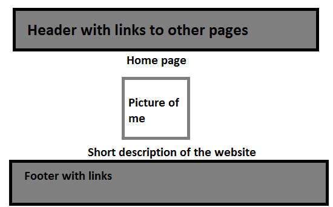
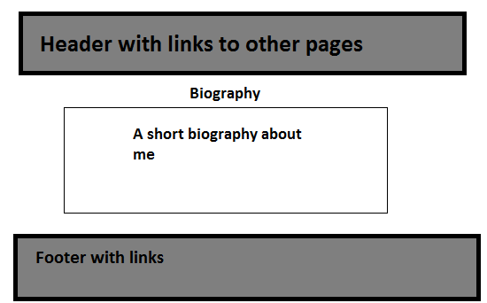
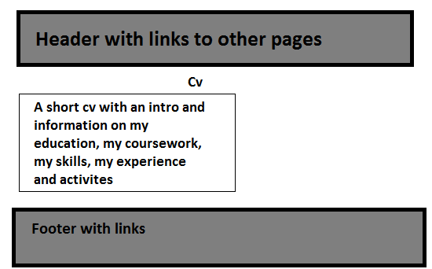
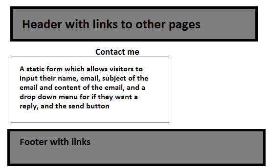
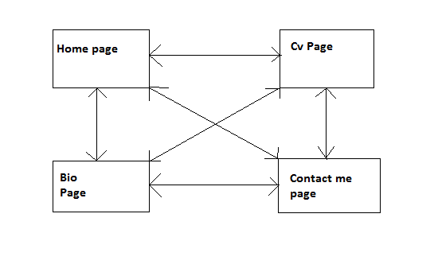

# csy1018_assign1
16407112 Jamie Luckett
What work have I done?
---------------
I have created a website with 4 different pages on, these are
- A home page
  - This is the page that is accessed at the start and includes an introduction about what the site is about and who I am, and also a picture of me with a header which is on all the pages which has links to the other pages, as well as a footer with a link to my github page and my email with icons for each
- A biogrphy page
  - This is the page that includes a short biography about who I am and what I do
- A cv page
  - This is the page that includes a short introduction, information about my education, relevant coursework that I am doing, experience, relevant skills I have and also any activites that are relevant but not related to my education.
- A contact page
  - This is the page that includes a static form which allows visitors to send an email to me by inputting information and clicking send.

I also have a css stylesheet which is used to change the formatting of text and images on my webpages such as changing the order of lists, changing text size and font, and text and background colours.

Who have I collaborated/worked with?
---------------
I have worked on my own to produce this website, with the only help being from the lectures and from nile.

How long has this assignment taken me?
---------------
This assignment has taken me about 50 hours to complete.

Storyboards and designs
---------------
**Home Page Design**

**Biography Page Design**

**Cv Page Design**

**Contact Page Design**

**Site Mapping**

